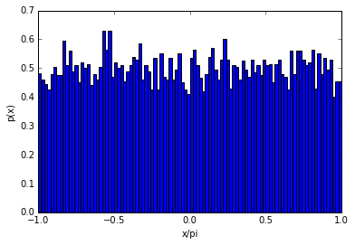
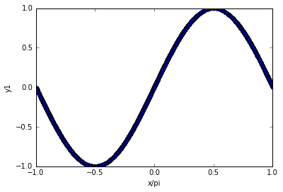
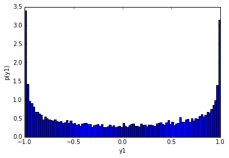
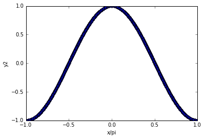
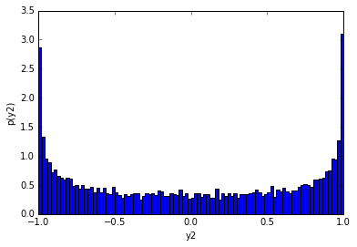

Demo 1
=================

First, generate a uniform distribution from -pi to pi(we denote as x):

Next, apply sin to x, and we get y1 and its probability distribution:

Then, apply cos to x, and we get y2 and its probability distribution:

Notice that these two probability distributions are nearly the same, but data points corresponding to the peak are different.

(For example, for y1, x=0.5\*pi corresponds to y1=1, but for y2, x=0\*pi corresponds to y2=1)
